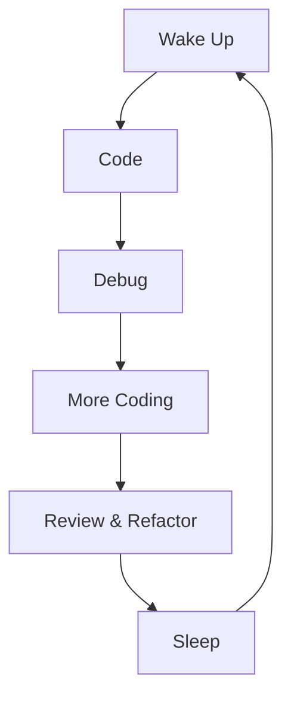

<!-- README.md -->

<h1 align="center">👋 Hello, I'm Your Name!</h1>

  
  

---

## 👤 Introduction

I'm a passionate **Developer** who loves crafting elegant code and solving challenging problems. Whether it's a new framework or a complex algorithm, I'm always up for the challenge! My areas of interest include:

- **Backend Development** 🌐
- **Data Structures & Algorithms** 📊
- **Machine Learning** 🤖
- **DevOps** 🚀

---

## 👨‍💻 Eat, Code, Sleep, Repeat

Here's a visual representation of my daily routine as a developer:

